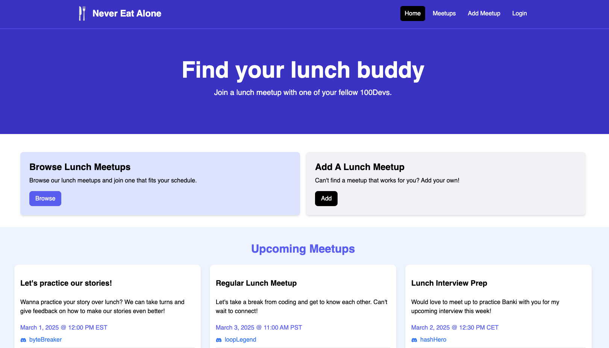
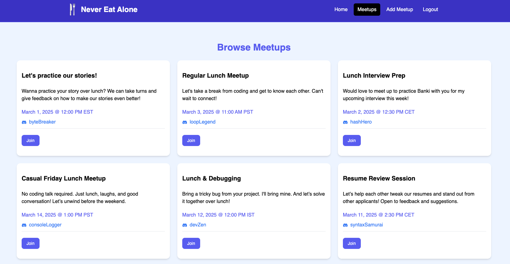
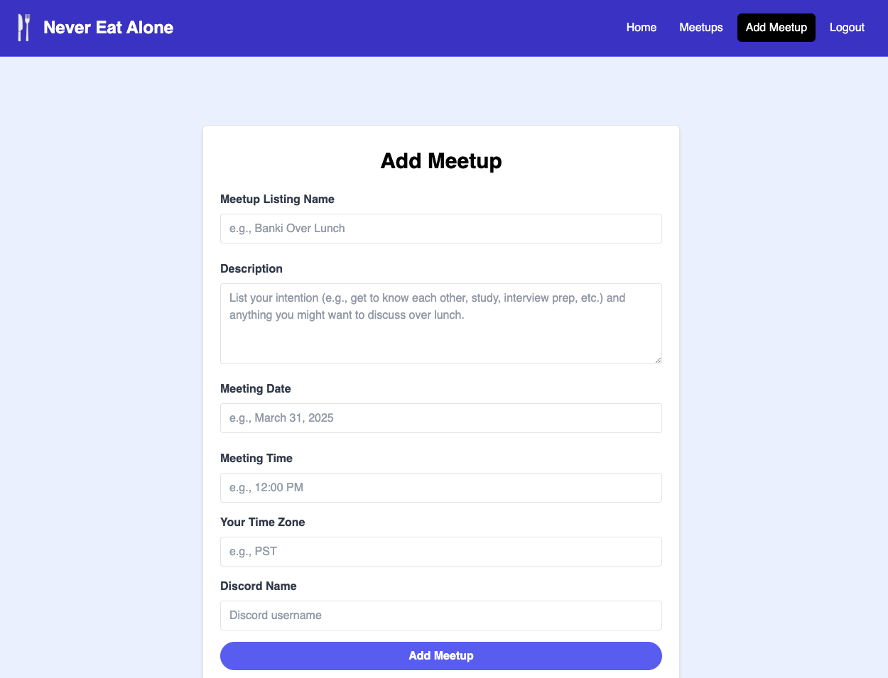
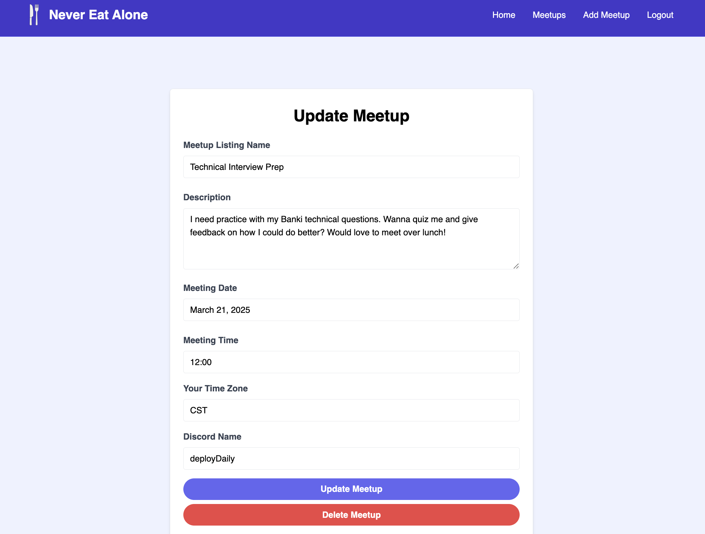
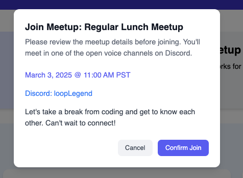

# Never Eat Alone | Meetup App

Never Eat Alone is a meetup app that helps members of 100Devs connect for purposeful gatherings. Whether it's sharing a casual lunch, studying together, or preparing for interviews, the app makes it easy to create and join meetups that strengthen the community's collaborative learning journey.

Tech Stack: JavaScript, React, Vite, Appwrite, Tailwind

**Link to project:** https://never-eat-alone-production.up.railway.app/

# How to Use
1. Clone repo.
2. Run npm install.
3. Run npm run dev.
4. Open the local host port that Vite assigns.
5. Create a .env file in the root directory.
- Add the .env file to your .gitignore file.
- Use the following format for your variables: VITE_VARIABLE_NAME = "value".
- You'll need the following variables: (1) VITE_APPWRITE_ENDPOINT, (2) VITE_PROJECT_ID, (3) VITE_DATABASE_ID, (4) VITE_USER_COLLECTION_ID, (5) VITE_MEETUP_COLLECTION_ID. 
- You can find the associated values once you have your project, database, and collections set up in Appwrite.

# Future Enhancements
- Profile pages that track meetups you've joined
- Filter functionality for meetups
- Expand authentication options
- Reminder notifications
- Auto-matching algorithm

# Optimizations
When I initially set up my auth checks for the meetup listing buttons (join/edit), each meetup listing was independently fetching the user data through the useEffect hook, causing a slow, sequential loading effect. I optimized this by lifting the user state up to the parent component. This prevented the load lag as all the data was fetched at once and immediately rendered. 

# Lessons Learned
Working with Appwrite for the first time opened my eyes to how powerful modern backend services can be. It made authentication and real-time updates incredibly intuitive. Building this project strengthened my React fundamentals and also gave me valuable experience integrating multiple technologies into a cohesive fullstack application.